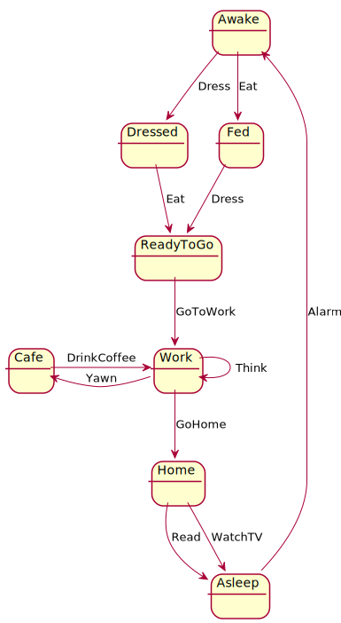

# A simple state machine example in Haskell

## To run

    $ stack ghci
    > runFrom Asleep [Alarm, Eat, Dress, GoToWork, Think, Think, Yawn, Coffee, Think, Yawn]
    Just Cafe
    > runFrom Work [WatchTV]
    Nothing

## The machine

